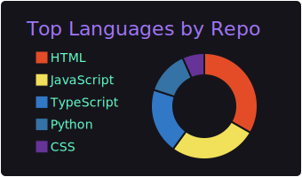
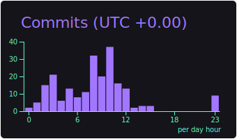
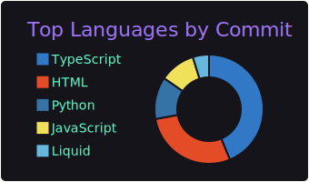
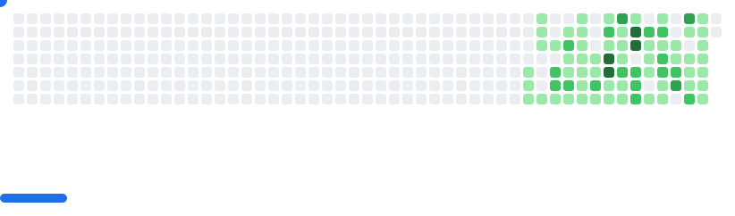

### Hi, I'm North 👋

I'm an AI research engineer specializing in large language models (LLMs), deep learning, and open-source development. 

My work focuses on AI research, building practical tools, and sharing knowledge through open-source contributions.  

##

| Statistics | Repositories by Language |
| :--- | :--- |
|  |  |

Productive Hours | Most Used Language
| :--- | :--- |
|  |  |

<picture>
  <source
    media="(prefers-color-scheme: dark)"
    srcset="images/breakout-dark.svg"
  />
  <source
    media="(prefers-color-scheme: light)"
    srcset="images/breakout-light.svg"
  />
  
</picture>

