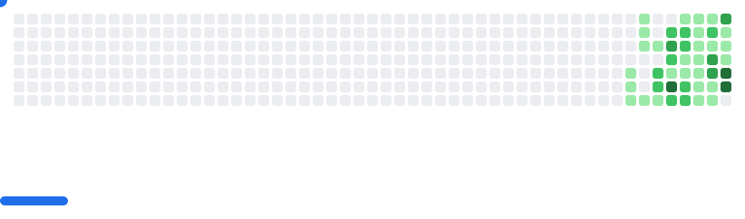

### My name is `norseson`, welcome to my `readme.md`!

<h2 align="center"> 👾 Full Stack Engineer 👾 </h2>

## 𒆙 About Me /

> **We don't just fix the code.** _We rewrite the world...._

<h3>My passion lies in taking systems—whether they're complex APIs or sprawling urban infrastructure—and finding the cleanest, most efficient way to solve their most persistent bugs. If you're looking for someone who treats a difficult project like a high-score challenge—and wins—you've found your collaborator. </h3>

 

<h4>I believe that the spirit of the edgerunner belongs in the development pipeline: constantly testing limits, finding the hidden path, and building the things the megacorps (and frankly, most teams) can’t. </h4>

_I don't just build; I optimize. I don't just fix; I future-proof._

## ⚡ What I bring to the Terminal:

- 🔭 Architectural Clarity: Designing systems that are scalable and maintainable. No more technical debt.
- 🧮 Creative Problem Solving: If a solution exists, I'll find it. If it doesn't, I'll code it.
- 👯 Decentralize Complexity: Breaking large problems into manageable, elegant microservices.
- 💬 Boost Performance: Making slow, clunky processes run with cyberpunk efficiency.

 

<h2>𒆙 Tech Stack</h2>

<strong>𒆙 Full Stack Developer</strong>

  

    <strong>▪︎ Frontend:</strong> 
    
  

  

    <strong>▪︎ Backend & Databases:</strong> 
    
  

  

    <strong>▪︎ DevOps & Ferramentas:</strong> 
    
  

   

<strong> 𒆙 Data Analyst</strong>

  

    <strong>▪︎ Languages ​​and Libraries:</strong> 
    
  

  

    <strong>▪︎ Databases and Cloud:</strong> 
    
  

## 𒆙 My Stats

| Statistics                                                                                       | Repositories by Language                                                                                      |
| ------------------------------------------------------------------------------------------------ | ------------------------------------------------------------------------------------------------------------- |
|  |  |

| Productive Hours                                                                                                       | Most Used Language                                                                                              |
| ---------------------------------------------------------------------------------------------------------------------- | --------------------------------------------------------------------------------------------------------------- |
|  |  |

  
<strong>"Let's build something that won't crash at 3 AM.

"</strong>

<picture>
  <source
    media="(prefers-color-scheme: dark)"
    srcset="images/breakout-dark.svg"
  />
  <source
    media="(prefers-color-scheme: light)"
    srcset="images/breakout-light.svg"
  />
  
</picture>

